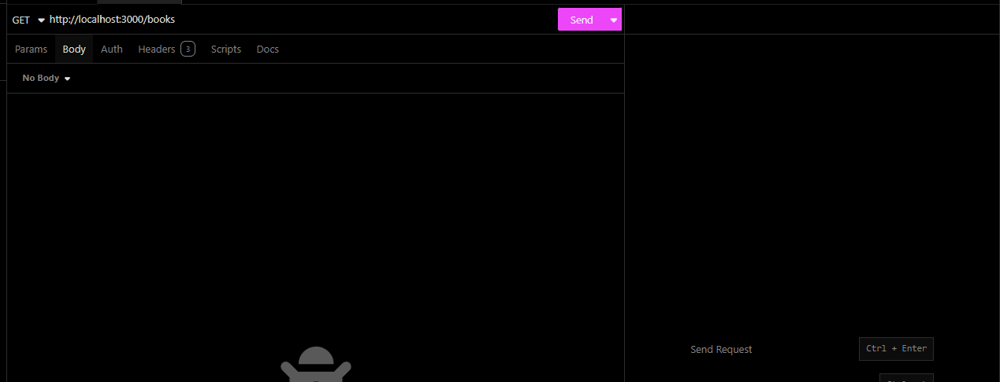
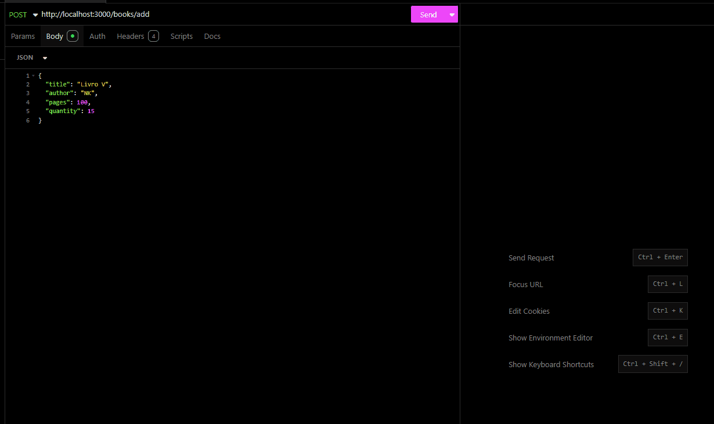
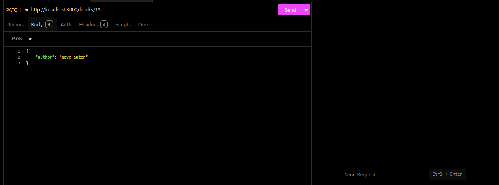
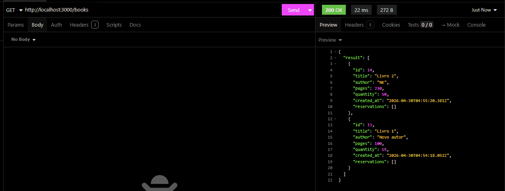

# API - Reserva de Livros

API para gerenciamento de livros e reservas, desenvolvida com Node.js, TypeScript, Fastify, Prisma e PostgreSQL.

O projeto cobre o fluxo principal de cadastro de livros, criação de reservas, controle de disponibilidade por período e atualização automática do status das reservas por cron job.

---

## Visão Geral

| Item | Descrição |
| --- | --- |
| Runtime | Node.js |
| Linguagem | TypeScript |
| Framework | Fastify |
| ORM | Prisma |
| Banco de dados | PostgreSQL |
| Validação | Zod |
| Testes | Vitest |
| Agendamentos | node-cron |

---

## Funcionalidades

- Cadastro, listagem, edição e remoção de livros.
- Criação e gerenciamento de reservas.
- Controle de limite de reservas por quantidade disponível do livro.
- Atualização automática de reservas `PENDING` para `ACTIVE`.
- Atualização automática de reservas `ACTIVE` para `FINISHED`.
- Validação dos dados de entrada com Zod.
- Persistência com Prisma e PostgreSQL.

---

## Como Rodar

### 1. Instale as dependências

```bash
npm install
```

### 2. Configure o ambiente

Crie um arquivo `.env` na raiz do projeto:

```env
PORT="SUA_PORTA"

DATABASE_URL="SUA_DATABASE_URL"

POSTGRES_USER=SEU_USUARIO
POSTGRES_PASSWORD=SUA_SENHA
POSTGRES_DB=SEU_BANCO
```

### 3. Suba o banco com Docker

```bash
docker-compose up -d
```

### 4. Rode as migrations

```bash
npx prisma migrate dev
```

### 5. Inicie a API

```bash
npm run dev
```

Por padrão, a API fica disponível em:

```text
http://localhost:3000
```

---

## Scripts

| Comando | Descrição |
| --- | --- |
| `npm run dev` | Inicia a API em modo desenvolvimento |
| `npm run build` | Compila o projeto TypeScript |
| `npm start` | Executa a versão compilada |
| `npm run lint` | Executa o ESLint com correção automática |
| `npm run test` | Executa os testes |
| `npm run test:watch` | Executa os testes em modo watch |

---

## Endpoints

### Healthcheck

| Método | Rota | Descrição |
| --- | --- | --- |
| `GET` | `/ping` | Verifica se a API está online |

### Livros

| Método | Rota | Descrição |
| --- | --- | --- |
| `GET` | `/books` | Lista todos os livros |
| `POST` | `/books/add` | Cadastra um novo livro |
| `PATCH` | `/books/:id` | Atualiza os dados de um livro |
| `DELETE` | `/books/:id` | Remove um livro |

### Reservas

| Método | Rota | Descrição |
| --- | --- | --- |
| `POST` | `/reservations/add` | Cria uma nova reserva |
| `PATCH` | `/reservations/:id` | Atualiza uma reserva existente |
| `DELETE` | `/reservations/:id` | Remove uma reserva |

---

## Exemplos Visuais

### Livros

#### Listar Livros



#### Adicionar Livro



#### Atualizar Livro



#### Remover Livro



### Reservas

#### Adicionar Reserva

GIF pendente: `./img/addReservation.gif`

#### Atualizar Reserva

GIF pendente: `./img/updateReservation.gif`

#### Remover Reserva

GIF pendente: `./img/deleteReservation.gif`

---

## Regras de Negócio

### Livros

- `title` e `author` são obrigatórios.
- `title` e `author` formam uma combinação única.
- `pages` deve ser maior que zero.
- `quantity` não pode ser negativa.

### Reservas

- Uma reserva sempre pertence a um livro.
- A reserva só pode ser criada para um livro existente.
- `start_date` e `end_date` precisam ser datas válidas.
- `end_date` não pode ser menor que `start_date`.
- O status inicial aceito no cadastro e `PENDING`.
- Se o período da reserva já estiver ativo, a API pode salvar a reserva como `ACTIVE`.
- O limite de reservas no mesmo período respeita a quantidade disponível do livro.

---

## Status das Reservas

| Status | Descrição |
| --- | --- |
| `PENDING` | Reserva criada para um período futuro |
| `ACTIVE` | Reserva dentro do período atual |
| `FINISHED` | Reserva com período encerrado |
| `CANCELLED` | Reserva cancelada |

---

## Agendamentos

A cada 10 minutos, a API executa uma rotina automática para manter os status das reservas atualizados.

| Condição | Ação |
| --- | --- |
| Reserva `PENDING` com `start_date` já iniciado | Atualiza para `ACTIVE` |
| Reserva `ACTIVE` com `end_date` encerrado | Atualiza para `FINISHED` |

Log esperado:

```text
[Job] Status das reservas atualizado
```

---

## Banco de Dados

O banco utilizado é PostgreSQL, executado via Docker Compose.

Para visualizar os dados com Prisma Studio:

```bash
npx prisma studio
```

Endereço padrão:

```text
http://localhost:5555
```

---

## Estrutura

```text
src/
  app/
    controllers/
    routes/
    useCases/
    utils/
  infra/
    plugins/
prisma/
  migrations/
  schema.prisma
tests/
  e2e/
```

---

## Autor

Victor Nikolaus
