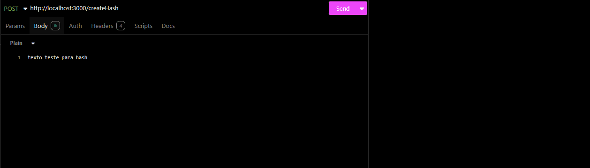
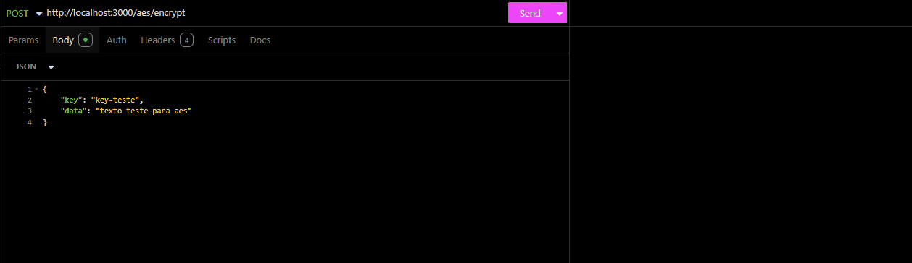
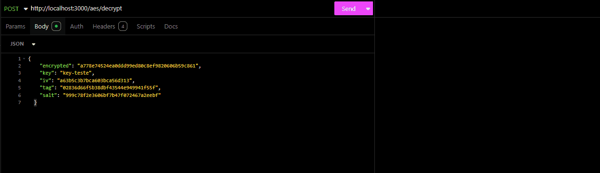

# API - Criptografia

API para geração de hashes e criptografia/descriptografia AES-256-GCM, desenvolvida com Node.js, TypeScript, Express e Zod.

O projeto cobre o fluxo principal de criação de hash SHA-512, criptografia de textos com chave simétrica e descriptografia segura usando `iv`, `tag` e `salt`.

---

## Visão Geral

| Item | Descrição |
| --- | --- |
| Runtime | Node.js |
| Linguagem | TypeScript |
| Framework | Express |
| Criptografia | node:crypto |
| Validação | Zod |
| Testes | Vitest |
| Lint | ESLint |

---

## Funcionalidades

- Healthcheck da API.
- Geração de hash SHA-512.
- Criptografia de textos com AES-256-GCM.
- Derivação de chave com `scrypt` e `salt` aleatório.
- Descriptografia usando `encrypted`, `iv`, `tag` e `salt`.
- Validação dos dados de entrada com Zod.
- Tratamento de erros padronizado para validação e descriptografia.

---

## Como Rodar

### 1. Instale as dependências

```bash
npm install
```

### 2. Configure o ambiente

Crie um arquivo `.env` na raiz do projeto:

```env
PORT=3000
```

### 3. Inicie a API

```bash
npm run dev
```

Por padrão, caso `PORT` não seja informado, a API usa:

```text
http://localhost:3001
```

---

## Scripts

| Comando | Descrição |
| --- | --- |
| `npm run dev` | Inicia a API em modo desenvolvimento |
| `npm run build` | Compila o projeto TypeScript |
| `npm start` | Executa a versão compilada |
| `npm run lint` | Executa o ESLint com correção automática |
| `npm run test` | Executa os testes |
| `npm run test:watch` | Executa os testes em modo watch |

---

## Endpoints

### Healthcheck

| Método | Rota | Descrição |
| --- | --- | --- |
| `GET` | `/ping` | Verifica se a API está online |

### Hash

| Método | Rota | Descrição |
| --- | --- | --- |
| `POST` | `/createHash` | Gera um hash SHA-512 a partir de um texto |

### AES

| Método | Rota | Descrição |
| --- | --- | --- |
| `POST` | `/aes/encrypt` | Criptografa um texto usando AES-256-GCM |
| `POST` | `/aes/decrypt` | Descriptografa um texto usando AES-256-GCM |

---

## Exemplos de Requisição

### Criar Hash

**POST** `/createHash`

Body `text/plain`:

```text
texto a ser hasheado
```

Resposta `201`:

```json
{
  "result": "hash gerado em SHA-512"
}
```

### Criptografar com AES

**POST** `/aes/encrypt`

Body `application/json`:

```json
{
  "key": "chave-secreta",
  "data": "texto a ser criptografado"
}
```

Resposta `201`:

```json
{
  "result": {
    "encrypted": "hex",
    "iv": "hex",
    "tag": "hex",
    "salt": "hex"
  }
}
```

### Descriptografar com AES

**POST** `/aes/decrypt`

Body `application/json`:

```json
{
  "key": "chave-secreta",
  "encrypted": "hex",
  "iv": "hex",
  "tag": "hex",
  "salt": "hex"
}
```

Resposta `200`:

```json
{
  "result": "texto original"
}
```

---

## Exemplos Visuais

### Criar Hash



### Criptografar com AES



### Descriptografar com AES



---

## Regras e Validações

### Hash

- O body deve ser enviado como `text/plain`.
- O texto não pode ser vazio.
- Espaços extras no início e no fim são removidos antes da geração do hash.
- O algoritmo utilizado é SHA-512.

### AES

- `key` e `data` são obrigatórios na criptografia.
- `encrypted`, `iv`, `tag`, `salt` e `key` são obrigatórios na descriptografia.
- `encrypted`, `iv`, `tag` e `salt` devem estar em formato hexadecimal.
- `iv` deve ter 24 caracteres hexadecimais.
- `tag` deve ter 32 caracteres hexadecimais.
- `salt` deve ter 32 caracteres hexadecimais.
- A chave AES é derivada com `scrypt` usando o `salt` retornado na criptografia.

---

## Estrutura

```text
src/
  controllers/
  services/
tests/
img/
```

---

## Autor

Victor Nikolaus
