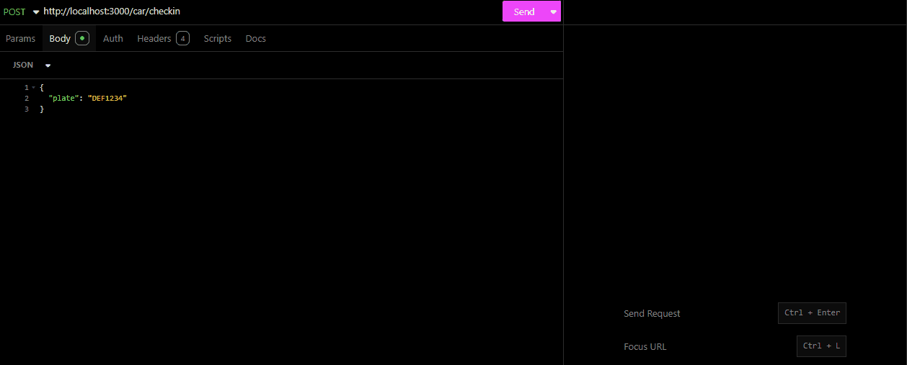
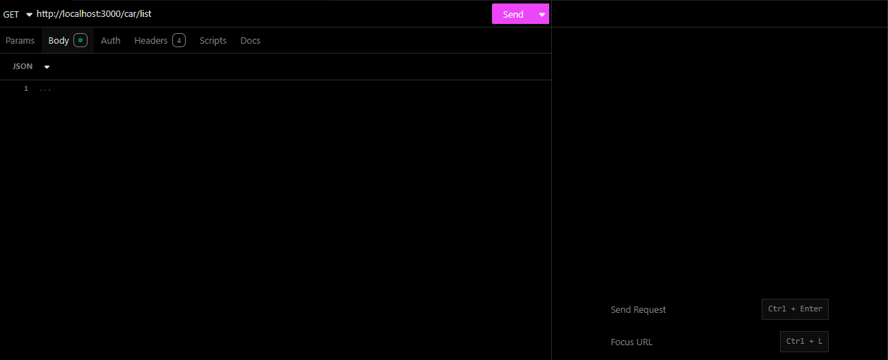

# API - Estacionamento

API para controle de check-in e check-out de veículos em um estacionamento, com cálculo automático do valor a pagar e persistência em KlauzDB.

O projeto cobre o fluxo principal de entrada de veículos, saída com cálculo de tarifa, listagem de registros e armazenamento em collections JSON.

---

## Visão Geral

| Item | Descrição |
| --- | --- |
| Runtime | Node.js |
| Linguagem | TypeScript |
| Framework | Express |
| Banco de dados | KlauzDB |
| Validação | Zod |
| Testes | Vitest |
| Lint | ESLint |

---

## Funcionalidades

- Healthcheck da API.
- Check-in de veículos por placa.
- Bloqueio de check-in duplicado para veículo já estacionado.
- Check-out de veículos estacionados.
- Cálculo automático do valor a pagar.
- Listagem de registros do estacionamento.
- Validação e normalização de placas.
- Persistência em collection JSON com KlauzDB.

---

## Como Rodar

### 1. Instale as dependências

```bash
npm install
```

### 2. Configure o ambiente

Crie um arquivo `.env` na raiz do projeto:

```env
PORT=3000
```

### 3. Inicie a API

```bash
npm run dev
```

Por padrão, caso `PORT` não seja informado, a API usa:

```text
http://localhost:3001
```

---

## Scripts

| Comando | Descrição |
| --- | --- |
| `npm run dev` | Inicia a API em modo desenvolvimento |
| `npm run build` | Compila o projeto TypeScript |
| `npm start` | Executa a versão compilada |
| `npm run lint` | Executa o ESLint com correção automática |
| `npm run test` | Executa os testes |
| `npm run test:watch` | Executa os testes em modo watch |

---

## Endpoints

### Healthcheck

| Método | Rota | Descrição |
| --- | --- | --- |
| `GET` | `/ping` | Verifica se a API está online |

### Veículos

| Método | Rota | Descrição |
| --- | --- | --- |
| `POST` | `/car/checkin` | Registra a entrada de um veículo |
| `PATCH` | `/car/checkout` | Registra a saída de um veículo |
| `GET` | `/car/list` | Lista os registros do estacionamento |

---

## Exemplos de Requisição

### Check-in

**POST** `/car/checkin`

Body `application/json`:

```json
{
  "plate": "ABC1234"
}
```

Resposta `201`:

```json
{
  "result": {
    "id": "uuid",
    "plate": "ABC1234",
    "parked": true,
    "info": {
      "checkin": 1758120137983,
      "total": 0
    }
  }
}
```

### Check-out

**PATCH** `/car/checkout`

Body `application/json`:

```json
{
  "plate": "ABC1234"
}
```

Resposta `200`:

```json
{
  "result": {
    "id": "uuid",
    "plate": "ABC1234",
    "parked": false,
    "info": {
      "checkin": 1758120137983,
      "checkout": 1758123737983,
      "total": 12
    }
  }
}
```

### Listar Veículos

**GET** `/car/list`

Resposta `200`:

```json
{
  "result": [
    {
      "id": "uuid",
      "plate": "ABC1234",
      "parked": false,
      "info": {
        "checkin": 1758120137983,
        "checkout": 1758123737983,
        "total": 12
      }
    }
  ]
}
```

---

## Exemplos Visuais

### Check-in



### Check-out


### Listar Veículos



---

## Regras e Validações

### Placas

- `plate` é obrigatório no check-in e no check-out.
- A placa é normalizada para maiúscula.
- Espaços e hífens são removidos antes da validação.
- Formatos aceitos: `ABC1234` e `ABC1D23`.

### Estacionamento

- Um veículo não pode fazer check-in se já estiver estacionado.
- Um veículo só pode fazer check-out se estiver estacionado.
- O check-out define `parked` como `false`.
- O campo `_zid` do KlauzDB não é exposto na listagem.

### Tarifação

- Até 15 minutos: gratuito.
- Até 1 hora: R$ 12,00.
- Após 1 hora: acréscimo de R$ 3,00 por hora adicional ou fração.

---

## Persistência

A API utiliza KlauzDB, um banco de dados baseado em collections JSON.

A collection runtime fica em:

```text
_collections/.parking.json
```

Esse arquivo é ignorado pelo Git. Um exemplo versionado fica em:

```text
_collections/.parking.example.json
```

---

## Estrutura

```text
src/
  _shared/
  app/
    controllers/
    useCases/
  infra/
    database/
tests/
  e2e/
  unit/
_collections/
img/
```

---

## Autor

Victor Nikolaus
