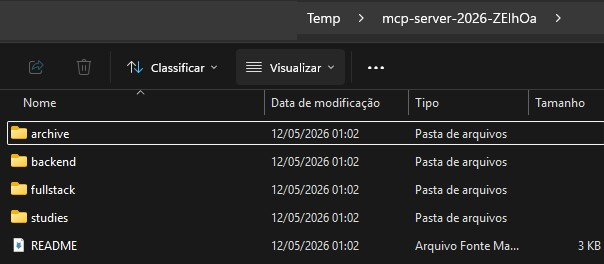
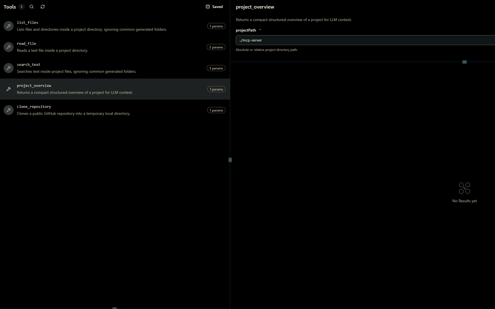
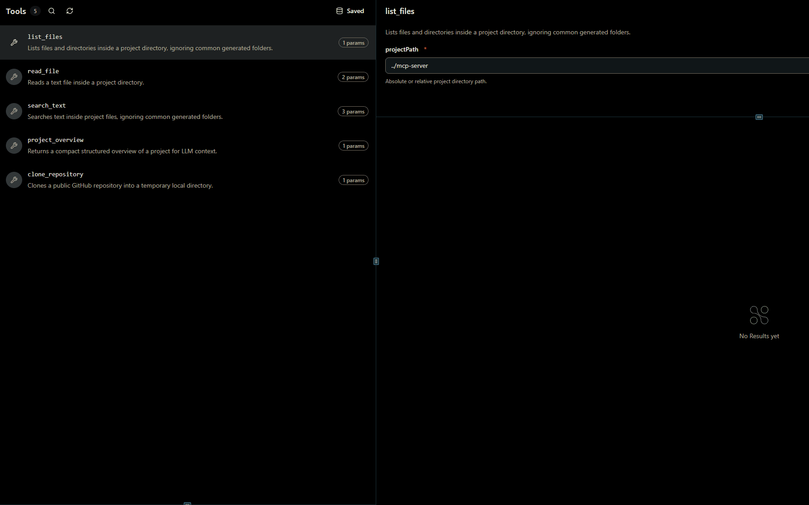
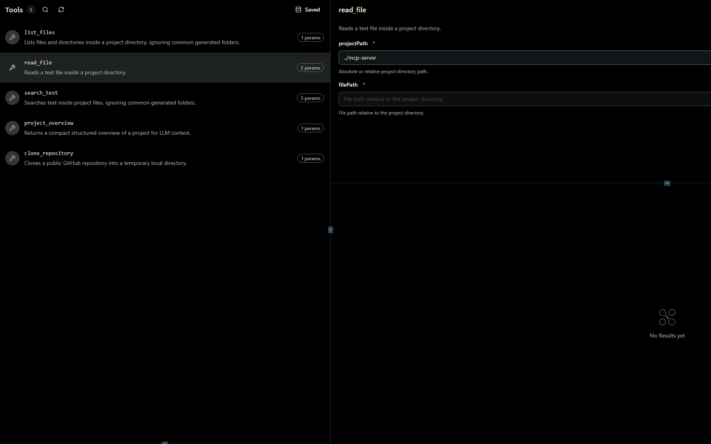
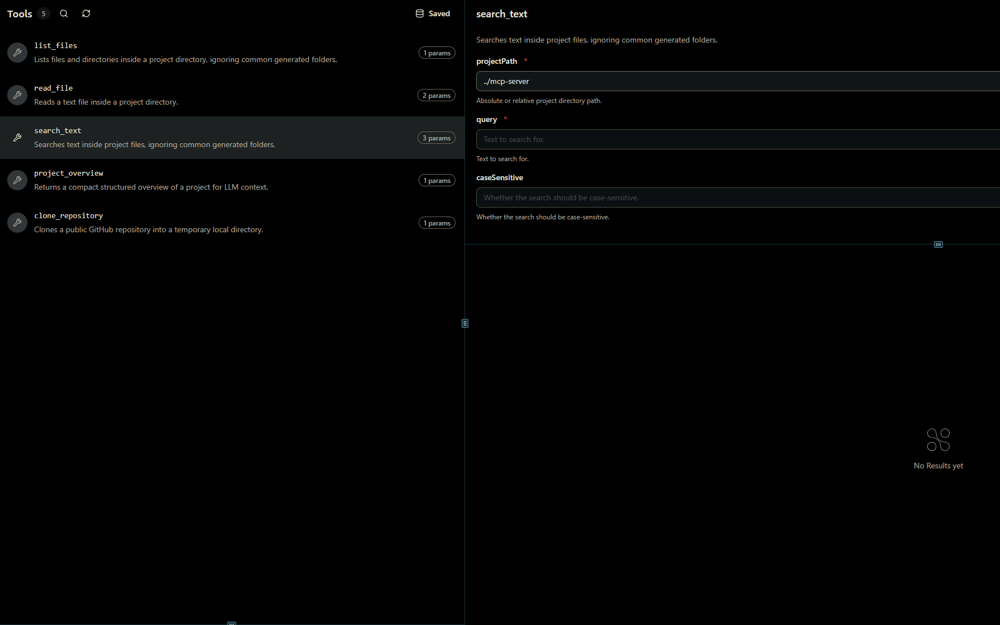

# MCP Server de Documentação Inteligente

Servidor MCP para analisar projetos de software locais ou repositórios públicos do GitHub.

O objetivo do projeto é fornecer ferramentas para que um LLM consiga navegar por um projeto, ler arquivos, buscar textos, gerar uma visão geral da estrutura e analisar repositórios clonados temporariamente.

---

## Visão Geral

| Item | Descrição |
| --- | --- |
| Runtime | Node.js |
| Linguagem | TypeScript |
| Protocolo | Model Context Protocol |
| Framework MCP | mcp-use |
| SDK MCP | @modelcontextprotocol/sdk |
| Validação | Zod |
| Git | simple-git |
| Busca de arquivos | fast-glob |
| Banco de dados | Não utiliza |
| Frontend | Não possui |

---

## Arquitetura

```txt
mcp-server/
  src/
    server/      # inicialização do servidor MCP
    tools/       # definição das tools expostas ao LLM
    services/    # regras de filesystem e repositórios
    utils/       # helpers de GitHub e overview
    types/       # tipos compartilhados
  public/        # assets publicos usados pelo mcp-use
  resources/     # pasta reservada para recursos/widgets futuros
```

### Módulos

| Módulo | Responsabilidade |
| --- | --- |
| `server` | Cria o servidor MCP com `mcp-use` e registra as tools |
| `tools` | Expõe as tools MCP para arquivos e repositórios |
| `services` | Implementa leitura, busca, overview e clone de repositórios |
| `utils` | Centraliza validações e heurísticas auxiliares |

---

## Funcionalidades

- Listagem de arquivos e pastas de um projeto.
- Leitura segura de arquivos dentro de um projeto.
- Busca de texto em arquivos do projeto.
- Visão geral objetiva da estrutura do projeto.
- Clone temporário de repositórios públicos do GitHub.
- Suporte ao inspector web do `mcp-use`.
- Bloqueio de path traversal em leitura de arquivos.
- Ignora `node_modules`, `.git`, `dist` e `build` nas tools de listagem, busca e overview.
- Ignora arquivos binários em `read_file` e `search_text`.
- Sem banco de dados, embeddings, Docker, autenticação ou IA interna no servidor.

---

## Tools MCP

| Tool | Descrição |
| --- | --- |
| `list_files` | Lista arquivos e pastas de um projeto |
| `read_file` | Lê um arquivo de texto dentro do projeto |
| `search_text` | Busca texto dentro dos arquivos do projeto |
| `project_overview` | Retorna uma visão geral estruturada do projeto |
| `clone_repository` | Clona um repositório público do GitHub em uma pasta temporária |

---

## Fluxo com repositório GitHub

O fluxo principal foi pensado para o usuário conversar naturalmente com um LLM.

Exemplo:

```txt
Olha esse repo https://github.com/user/repo e me explica para que serve esse projeto.
```

Fluxo esperado:

```txt
1. O LLM chama clone_repository com a URL do GitHub
2. O servidor valida a URL pública do GitHub
3. O repositório é clonado com --depth 1 em uma pasta temporária
4. A pasta .git é removida após o clone
5. A tool retorna o projectPath temporário
6. O LLM chama project_overview usando esse projectPath
7. O LLM usa list_files, read_file e search_text conforme necessário
8. O LLM responde em linguagem natural para o usuário
```

## Demonstração das tools

### Clone de repositório

A tool `clone_repository` recebe uma URL pública do GitHub, cria uma pasta temporária e clona o projeto usando `--depth 1`.

Exemplo de retorno:

```json
{
  "repositoryUrl": "https://github.com/user/repo",
  "cloneUrl": "https://github.com/user/repo.git",
  "owner": "user",
  "repo": "repo",
  "projectPath": "C:/Users/.../Temp/mcp-server-repo-context-a1B2c3",
  "temporary": true
}
```

Pasta temporária criada após o clone:



### Visão geral do projeto

A tool `project_overview` retorna dados compactos para o LLM entender rapidamente a estrutura do projeto.

Ela inclui:

- arquivos da raiz
- pastas principais
- pastas dentro de `src`
- scripts do `package.json`
- dependencies e devDependencies
- candidatos a entrypoint
- arquivos de teste



### Listagem de arquivos

A tool `list_files` lista arquivos e pastas do projeto, ignorando diretórios comuns de build e dependência.



### Leitura de arquivo

A tool `read_file` lê arquivos de texto de forma segura, garantindo que o path solicitado esteja dentro do projeto.



### Busca de texto

A tool `search_text` busca ocorrências dentro dos arquivos do projeto e retorna caminho, linha, coluna e preview.



---

## Exemplo de chamadas

### Clonar repositório

```json
{
  "url": "https://github.com/octocat/Hello-World"
}
```

Retorno esperado:

```json
{
  "repositoryUrl": "https://github.com/octocat/Hello-World",
  "cloneUrl": "https://github.com/octocat/Hello-World.git",
  "owner": "octocat",
  "repo": "Hello-World",
  "projectPath": "C:/Users/.../Temp/mcp-server-repo-context-a1B2c3",
  "temporary": true
}
```

### Gerar overview

```json
{
  "projectPath": "C:/Users/.../Temp/mcp-server-repo-context-a1B2c3"
}
```

### Ler arquivo

```json
{
  "projectPath": "C:/Users/.../Temp/mcp-server-repo-context-a1B2c3",
  "filePath": "README.md"
}
```

### Buscar texto

```json
{
  "projectPath": "C:/Users/.../Temp/mcp-server-repo-context-a1B2c3",
  "query": "install"
}
```

---

## Segurança e limites

- `read_file` bloqueia caminhos que escapam do projeto, como `../../arquivo.txt`.
- Paths reais são resolvidos com `fs.realpath`, evitando leitura por symlink para fora da raiz.
- Arquivos maiores que `1 MB` não são lidos.
- Arquivos binários são recusados em `read_file`.
- Arquivos binários são ignorados em `search_text`.
- `search_text` limita o retorno a `100` ocorrências.
- `clone_repository` aceita apenas URLs HTTPS do GitHub.
- Repositórios clonados são temporários e devem ser removidos manualmente por enquanto.

---

## Como rodar

Instalar dependências:

```bash
npm install
```

Rodar em desenvolvimento:

```bash
npm run dev
```

Abrir o inspector:

```txt
http://localhost:3000/inspector
```

---

## Variáveis de ambiente

O projeto possui um `.env` simples:

```env
PORT=
MCP_URL=
```

Quando `PORT` e `MCP_URL` estão vazios, o servidor usa:

```txt
http://localhost:3000
```

---

## Scripts

| Comando | Descrição |
| --- | --- |
| `npm run dev` | Inicia o servidor MCP com inspector do mcp-use |
| `npm run build` | Gera build usando mcp-use |
| `npm start` | Executa o servidor em modo produção |
| `npm run typecheck` | Executa checagem de tipos com TypeScript |

---

## Estrutura

```txt
src/
  server/
    index.ts
  tools/
    fileTools.ts
    repositoryTools.ts
  services/
    FileSystemService.ts
    RepositoryService.ts
  utils/
    github.ts
    projectOverview.ts
  types/
```

---

## Pontos de projeto

- O servidor não usa IA internamente.
- O LLM é responsável por interpretar os dados retornados pelas tools.
- As tools retornam informações objetivas e estruturadas.
- `clone_repository` prepara repositórios públicos para análise local.
- `project_overview` reduz a quantidade de chamadas necessárias para entender um projeto.
- `read_file`, `list_files` e `search_text` são a base para navegação e investigação do código.

---

## Autor

Victor Nikolaus
